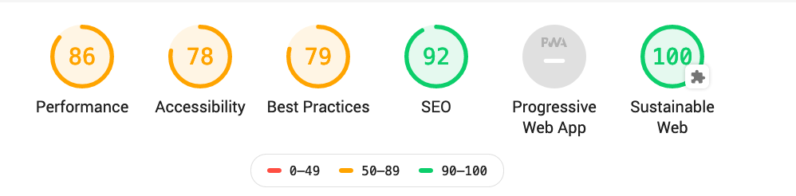

# Greenhouse CI - Greenhouse checks, optimised for continuous integration

If you want to run the web on renewable power, it helps to know how well you're already doing already, and it helps to make it easy to use.

### Enter Greenhouse CI



Greenhouse CI makes it easy to run these checks. Install this, and then run the command like so, passing in the

```
npx lighthouse-ci http://google.com --plugins=lighthouse-plugin-greenhouse
```

You'll get a response like so:

```
Running Lighthouse on http://google.com...

performance: 90
accessibility: 78
best-practices: 79
seo: 92
pwa: 48
lighthouse-plugin-greenhouse: 100
```

If you pass in the `--report directory-name` flag, with the directory to put an html report in, you can see the full report too, as the screenshot above shows.

In this case, because Google runs on green energy, the page only loads images or scripts from sites than run on green energy too, we have a perfect 100 score.

Sadly, most sites do not run on green power, but it's worth looking for them, and they do exist, and it's getting easier to find them.

You really don't need to look so far - Microsoft and Google are already prettyy good in this area, and [this whitepaper, _The state of data centre energy use in 2018_][whitepaper], gives a good idea of your options.

[whitepaper]: https://docs.google.com/document/d/1eCCb3rgqtQxcRwLdTr0P_hCK_drIZrm1Dpb4dlPeG6M/edit#

### Running checks in a docker container

You can also run this as container

```shell
docker build -t your-tag-name .
```

Once you've built the container, you can then run it in Kubernetes cluster, or anywhere you might choose to run containers:

```
docker run  -p 3000:3000 your-tag-name:latest
```

### Credits and Acknowledgements

Greenhouse-CI leans _heavily_ on the fantastic [Lighthouse CI](https://github.com/andreasonny83/lighthouse-ci/), as well as taking inspiration from [Giant Swarm's Lighthouse Keeper](https://github.com/giantswarm/lighthouse-keeper/) - in fact is uses much of the same dockerfile.

The main changes from Lighthouse CI are:

- there being a docker file to make it convenient to run anywhere you run containers
- the use of a [lighthouse plugin from The Green Web Foundation called Greenhouse](https://github.com/thegreenwebfoundation/lighthouse-plugin-greenhouse), to add the extra metrics, and carry out checks

The main changes from Lighthouse Keeper are:

- it's written entirely in javascript, not Go.
- it does not rely on a docker to be installed if you already have chrome installed on your computer
- it has a basic HTTP API, so you can run it on a server somewhere, and check sites without needing to run lighthouse on your local machine.
